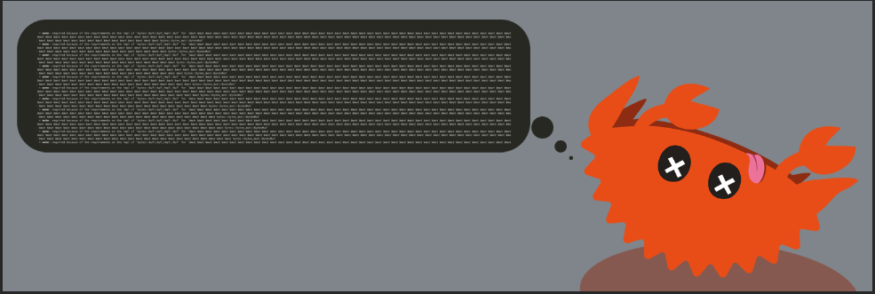

## Ferrisnomicon

[Follow @ferrisnomicon on Twitter!](https://twitter.com/ferrisnomicon)

### Exploring rustc's most spectacular fails!

In this repository you can find the most spectacular (and fun!) rustc fails, and vote for your favorite one!

:warning: Note the contest will focus on compile time and runtime errors. Internal Compiler Errors (ICEs) aren't in the scope of the contest. You should report those to [the Rust Compiler issue tracker.](https://github.com/rust-lang/rust/issues/) :warning:

### The supernova challenge

The contestant that will be able to generate the longest error message with the shortest number of characters in their code will win the challenge.

### The fun challenge

Head over to the [issues section](https://github.com/o0Ignition0o/ferrisnomicon/issues) to find some super fun fails, and use the available emojis to show your support! :thumbsup: :heart: For your information, only positive emojis will be counted, and :rocket: counts as positive too :grin:
Vote for the most fun fails, or submit yours. The one with the most positive votes wins!

### Contest time frame

The contest will follow the Rust release train.

Each new release will mark the end of a given contest. We will then nominate the most fun entry and the winner of the supernova challenge, and let people submit bugs for the new Rust version.

### Submit a fail

Triggered a spectatular error message? Head over to the issues section and [Submit it!](https://github.com/o0Ignition0o/ferrisnomicon/issues/new)

We would like to make the contest as fun as possible, and hopefully useful for the Rust compiler team, It would be amazing if contestants could submit issues providing:

- The section you register this fail for (Either the supernova or the fun challenge)

- A screenshot of the fail (or a snippet of the output)

- The version of rustc that triggered the error (it's the output of `rustc --version`). It must be either the latest stable, beta, or a nightly.

- A (hopefully small) reproducible code sample

- Bonus points if there's a link to the rust playground!

- Maybe a snarky comment that will suit the screenshot?

### Found a rustc fail on the twitterverse ?

Go ahead and [@ferrisnomicon](https://twitter.com/ferrisnomicon) so we can ask them to enter the contest :D
